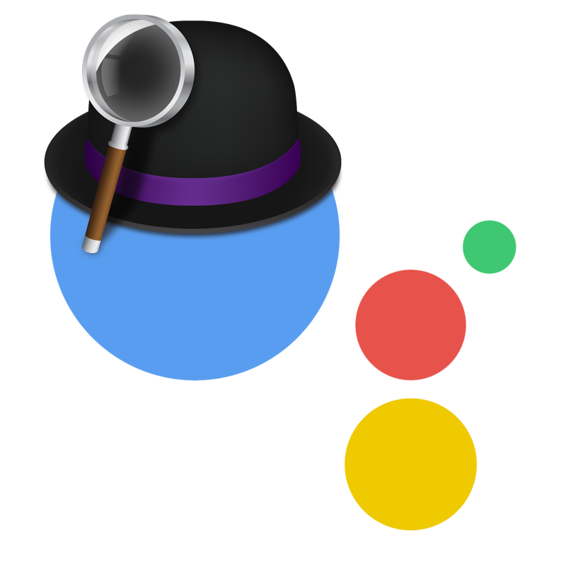

# Alfred-GoogleAssistant

Use Google Assistant SDK on macOS with Alfred

Latest version : v0.3.0

## Installation

- Follow [this tutorial](https://github.com/googlesamples/assistant-sdk-python/tree/master/google-assistant-sdk/googlesamples/assistant/grpc) to install `google-assistant-sdk`
- Install [this workflow](https://github.com/hug33k/Alfred-GoogleAssistant/releases/download/0.3.0/Google.Assistant.alfredworkflow) on Alfred
- Type `gasetup` on Alfred and set path of your `googlesamples-assistant-pushtotalk` file
  - Path can be found with `which googlesamples-assistant-pushtotalk`
- Run Google Assistant by pressing __Control__+__Space__ or by typing `gassist` on Alfred.

## Notes

This workflow has been made for Google Assistant SDK v0.3.0, it may not work well with newer version.
If you have any issue, please open an issue or feel free to make a PR ;)
